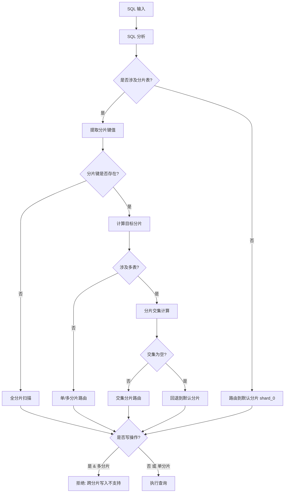

# Sharding Design

本文档描述 Athena MySQL Proxy 的分片（Sharding）功能设计，包括配置方式、支持的算法、SQL 分析与改写、跨分片查询处理以及事务语义。

---

## 目录

1. [设计目标](#设计目标)
2. [配置方式](#配置方式)
3. [分片算法](#分片算法)
4. [SQL 分析](#sql-分析)
5. [路由流程](#路由流程)
6. [SQL 改写](#sql-改写)
7. [跨分片读取](#跨分片读取)
8. [事务处理](#事务处理)
9. [错误处理](#错误处理)
10. [已知限制与未来工作](#已知限制与未来工作)

---

## 设计目标

### Goals

- **规则驱动分片**：通过配置文件定义分片规则，支持按表、按列进行分片
- **分片键路由**：根据 SQL 中的分片键值，精确路由到目标分片
- **简单聚合支持**：跨分片 SELECT 支持 `COUNT`、`SUM`、`MAX`、`MIN` 聚合合并
- **读写分离集成**：分片与读写分离无缝配合

### Non-Goals

- **跨分片写入**：不支持跨分片的 INSERT/UPDATE/DELETE（✅ 已实现拒绝）
- **分布式事务**：不支持跨分片事务（事务绑定到单一分片）
- **复杂聚合**：不支持 `GROUP BY`、`DISTINCT`、`ORDER BY` 等复杂聚合的跨分片合并
- **跨分片 JOIN**：不支持涉及不同分片键的表 JOIN（✅ 空交集已拒绝）

---

## 配置方式

分片规则在 Group 配置中通过 `sharding_rules` 和 `db_groups` 定义：

```toml
[[groups]]
name = "my_database"
user = "app_user"
password = "proxy_password"
home_group = "home"           # 非分片表的 db_group 名称

# 分片规则（每张表的分片策略）
[[groups.sharding_rules]]
name = "user_shard"           # 规则名称（用于日志/调试）
table_pattern = "users"       # 表名模式（精确匹配，大小写不敏感）
shard_column = "user_id"      # 分片键列名
algorithm = "mod"             # 分片算法：mod | hash | range
shard_count = 4               # 分片数量（该表的分片数）

[[groups.sharding_rules]]
name = "order_shard"
table_pattern = "orders"
shard_column = "order_id"
algorithm = "hash"
shard_count = 8

# Home 数据库组（非分片表）
[[groups.db_groups]]
name = "home"
# shard_indices 留空表示这是 home group

[[groups.db_groups.instances]]
host = "10.0.0.1"
port = 3306
user = "mysql_user"
password = "mysql_password"
database = "my_database"
role = "master"

# 分片数据库组（通过 shard_indices 声明负责的分片索引）
[[groups.db_groups]]
name = "db0"
shard_indices = [0, 1]        # 负责 shard_index 0 和 1

[[groups.db_groups.instances]]
host = "10.0.1.1"
port = 3306
user = "mysql_user"
password = "mysql_password"
database = "my_database_shard_0"
role = "master"

[[groups.db_groups]]
name = "db1"
shard_indices = [2, 3]        # 负责 shard_index 2 和 3

[[groups.db_groups.instances]]
host = "10.0.2.1"
port = 3306
user = "mysql_user"
password = "mysql_password"
database = "my_database_shard_1"
role = "master"
```

### 配置说明

- **`home_group`**：指定非分片表的 db_group 名称（默认 `"home"`）
- **`shard_indices`**：每个 db_group 声明它负责的分片索引列表
  - 留空表示这是 home group
  - 一个 db_group 可以负责多个 shard_index（如 `[0, 1]`）
- **路由过程**：
  1. `shard_index = algorithm(shard_column) % shard_count`
  2. 物理表名 = `逻辑表名_shard_index`
  3. 根据 `shard_indices` 找到对应的 db_group

---

## 分片算法

支持三种分片算法，**Mod 和 Hash 均基于 hashcode 实现**，因此都支持整数和字符串类型的分片键。

### 1. Mod（取模）

```
shard_index = hash(value) % shard_count
```

**配置示例：**
```toml
[[groups.sharding_rules]]
name = "user_shard"
table_pattern = "users"
shard_column = "user_id"
algorithm = "mod"
shard_count = 4
```

**特点：**
- 基于 hashcode，支持整数和字符串分片键
- 同一 value 保证路由一致
- 与 Hash 算法行为相同（两者可互换）

### 2. Hash（哈希）

```
shard_index = hash(value) % shard_count
```

使用 Rust 标准库的 `DefaultHasher`，保证同一值总是路由到同一分片。

**配置示例：**
```toml
[[groups.sharding_rules]]
name = "order_shard"
table_pattern = "orders"
shard_column = "order_id"
algorithm = "hash"
shard_count = 8
```

**特点：**
- 支持整数和字符串分片键
- 同一 value 保证路由一致
- 与 Mod 算法行为相同（两者可互换）

**字符串分片键示例：**
```sql
-- 按 tenant_id 分片
SELECT * FROM orders WHERE tenant_id = 'acme_corp';
INSERT INTO orders (tenant_id, amount) VALUES ('beta_inc', 100);
```

### 3. Range（范围）

根据预定义的边界值划分分片：

```
boundaries = [B1, B2, B3]
shard_0: value < B1
shard_1: B1 <= value < B2
shard_2: B2 <= value < B3
shard_3: value >= B3
```

**配置示例：**
```toml
[[groups.sharding_rules]]
name = "log_shard"
table_pattern = "logs"
shard_column = "log_date"
algorithm = "range"
range_boundaries = [20230101, 20230401, 20230701, 20231001]
```

**路由示例：**
- `log_date = 20221215` → shard_0 (< 20230101)
- `log_date = 20230215` → shard_1 (>= 20230101, < 20230401)
- `log_date = 20231101` → shard_4 (>= 20231001)

---

## SQL 分析

### 分片键提取

SQL 分析器从以下位置提取分片键值：

#### 1. WHERE 条件

**等值条件：**
```sql
SELECT * FROM users WHERE user_id = 123;
-- 提取: user_id = 123 → Single(123)
```

**IN 列表：**
```sql
SELECT * FROM users WHERE user_id IN (1, 2, 3, 4);
-- 提取: user_id IN [1,2,3,4] → Multiple([1,2,3,4])
```

**BETWEEN 范围：**
```sql
SELECT * FROM users WHERE user_id BETWEEN 100 AND 200;
-- 提取: user_id BETWEEN 100 AND 200 → Range{start:100, end:200}
```

#### 2. INSERT VALUES

```sql
INSERT INTO users (user_id, name) VALUES (123, 'Alice');
-- 提取: user_id = 123 → Single(123)

INSERT INTO users (user_id, name) VALUES (1, 'A'), (2, 'B'), (5, 'C');
-- 提取: user_id IN [1,2,5] → Multiple([1,2,5])
```

### 提取规则

| 条件类型 | 提取结果 | 路由行为 |
|---------|---------|---------|
| `col = value` | Single | 单分片 |
| `col IN (v1,v2,...)` | Multiple | 多分片（去重） |
| `col BETWEEN a AND b` | Range | 范围内所有分片 |
| 无分片键条件 | Unknown | 全分片扫描 |

### 当前限制

- **不支持占位符**：`user_id = ?` 无法提取
- **不支持复杂表达式**：`user_id + 1 = 100` 无法提取
- **不支持 OR 条件**：`user_id = 1 OR user_id = 2` 会触发全分片扫描
- **JOIN 条件不提取**：仅从 WHERE 子句提取
- **Range 仅支持整数**：`BETWEEN` 条件仅支持整数值

### 支持特性

- ✅ 整数和字符串分片键
- ✅ 复合标识符（如 `u.user_id`、`table.column`）
- ✅ 单引号和双引号字符串

---

## 路由流程



### 路由决策

1. **非分片表**：路由到 `shard_0`
2. **有分片键**：根据算法计算目标分片
3. **无分片键**：全分片扫描（仅 SELECT 允许）
4. **多表查询**：取各表目标分片的交集
5. **交集为空**：回退到默认分片（避免 panic）

### 读写路由

| 语句类型 | 事务外 | 事务内 |
|---------|--------|--------|
| SELECT | Slave | Master |
| INSERT/UPDATE/DELETE | Master | Master |
| BEGIN/COMMIT/ROLLBACK | Master | Master |

---

## SQL 改写

### 表名替换规则

逻辑表名 → 物理表名的映射：

```
{table_name} → {table_name}_{shard_index}
```

**示例：**
```sql
-- 原始 SQL
SELECT * FROM users WHERE user_id = 5;

-- 改写后（路由到 shard_1）
SELECT * FROM users_1 WHERE user_id = 5;
```

### 改写支持

| 场景 | 支持 | 示例 |
|-----|------|------|
| 普通表名 | ✅ | `FROM users` → `FROM users_1` |
| 反引号表名 | ✅ | `` FROM `users` `` → `` FROM `users_1` `` |
| JOIN 表名 | ✅ | `JOIN orders` → `JOIN orders_1` |
| 表别名引用 | ✅ | `users.id` → `users_1.id` |
| 字符串内表名 | ❌ 不替换 | `'users'` 保持不变 |
| 注释内表名 | ❌ 不替换 | `-- users` 保持不变 |

### 改写算法

基于字符串扫描的改写（非 AST）：
1. 跳过单引号/双引号字符串
2. 跳过 `--` 和 `/* */` 注释
3. 处理反引号标识符
4. 边界检查（确保不是标识符的一部分）

---

## 跨分片读取

### 执行策略

当查询命中多个分片时（scatter query）：

1. **顺序执行**：依次在每个分片上执行改写后的 SQL
2. **结果合并**：将各分片结果拼接返回给客户端
3. **协议处理**：
   - 只有第一个分片返回列定义
   - 中间分片只返回数据行
   - 最后一个分片返回 EOF

### 简单聚合合并 ✅ 已实现

对于以下聚合函数，支持跨分片合并：

| 函数 | 合并策略 | 状态 |
|------|---------|------|
| `COUNT(*)` | 各分片 count 求和 | ✅ 已实现 |
| `SUM(col)` | 各分片 sum 求和 | ✅ 已实现 |
| `MAX(col)` | 各分片 max 取最大 | ✅ 已实现 |
| `MIN(col)` | 各分片 min 取最小 | ✅ 已实现 |
| `AVG(col)` | 各分片 avg 平均（注意：当前实现有精度问题） | ⚠️ 部分支持 |

**实现细节：**
1. SQL 分析器检测 SELECT 中的聚合函数（`src/parser/analyzer.rs`）
2. 执行各分片查询
3. `AggregateMerger` 解析并合并各分片结果（`src/parser/aggregator.rs`）
4. 构造单行合并结果返回给客户端

**示例：**
```sql
-- 跨 4 个分片的 COUNT/SUM/MAX/MIN 将被正确合并
SELECT COUNT(*), SUM(amount), MAX(amount), MIN(amount) FROM orders;
```

### 当前行为

- ✅ 简单聚合（COUNT/SUM/MAX/MIN）正确合并
- 非聚合 scatter 查询：多分片结果直接拼接
- **不支持** `ORDER BY`（各分片结果顺序不保证）
- **不支持** `LIMIT`（各分片都执行完整 LIMIT，结果可能超出预期）
- **不支持** `GROUP BY`（各分片分组不会合并）
- **AVG 精度问题**：当前实现对各分片 AVG 结果再求平均，而非 SUM/COUNT 后计算

---

## 事务处理

### 单分片绑定

事务采用"延迟绑定"策略：

1. `BEGIN` 仅标记会话进入事务状态，不立即绑定分片
2. 第一条 DML/SELECT 根据路由结果绑定到目标分片
3. 后续所有语句必须路由到同一分片
4. `COMMIT/ROLLBACK` 提交/回滚并解除绑定

```sql
BEGIN;                              -- 标记事务开始
SELECT * FROM users WHERE user_id = 5;  -- 绑定到 shard_1
UPDATE users SET name = 'Bob' WHERE user_id = 5;  -- OK: 同一分片
SELECT * FROM users WHERE user_id = 1;  -- ERROR: 跨分片
COMMIT;                             -- 提交并解除绑定
```

### 跨分片拒绝

事务内遇到跨分片查询时：

```sql
ERROR 1105 (HY000): Cross-shard query in transaction not allowed 
(bound to shard_1, query targets shard_0)
```

### Scatter Query 拒绝

事务内遇到全分片扫描时：

```sql
ERROR 1105 (HY000): Scatter queries not allowed in transaction
```

---

## 错误处理

### 错误码定义

| 场景 | MySQL 错误码 | SQLSTATE | 消息 | 状态 |
|------|-------------|----------|------|------|
| 跨分片写入 | 1105 | HY000 | Scatter writes not allowed: INSERT/UPDATE/DELETE must target a single shard | ✅ 已实现 |
| 空交集 | 1105 | HY000 | Empty shard intersection: query involves multiple sharded tables with no common shard | ✅ 已实现 |
| 事务内跨分片 | 1105 | HY000 | Cross-shard query in transaction not allowed | ✅ 已实现 |
| 事务内 Scatter | 1105 | HY000 | Scatter queries not allowed in transaction | ✅ 已实现 |

### 空交集处理

当多表查询的分片交集为空时（如 `users.user_id=1` 和 `orders.order_id=2` 路由到不同分片）：

**当前行为**：返回错误 "Empty shard intersection"

**示例**：
```sql
-- 假设 users.user_id=1 路由到 shard_2，orders.order_id=2 路由到 shard_0
SELECT * FROM users u JOIN orders o ON u.id = o.user_id 
WHERE u.user_id = 1 AND o.order_id = 2;

-- 返回错误：
-- ERROR 1105 (HY000): Empty shard intersection: query involves multiple sharded tables with no common shard
```

---

## 已知限制与未来工作

### 当前限制

| 限制 | 影响 | 建议 |
|-----|------|------|
| 无参数提取 | PreparedStatement 走全分片 | 使用字面量查询 |
| 顺序执行 | Scatter 查询性能较低 | 避免全分片扫描 |
| 无结果合并 | ORDER BY/LIMIT 语义错误 | 应用层处理排序分页 |
| 字符串改写 | 复杂 SQL 可能改写错误 | 使用简单 SQL 结构 |
| Range 仅支持整数 | 字符串不能用于 Range 分片 | 使用 Mod/Hash 算法 |
| AVG 精度问题 | 各分片 AVG 再平均而非 SUM/COUNT | 使用 SUM 和 COUNT 分开查询 |

### 已完成改进

- ✅ **Scatter 写入拒绝**：非 SELECT 的 scatter query 返回错误
- ✅ **空交集错误**：多表查询分片交集为空时返回错误
- ✅ **字符串分片键**：Mod 和 Hash 算法均支持字符串分片键
- ✅ **复合标识符**：支持 `table.column` 形式的列名提取
- ✅ **简单聚合合并**：COUNT/SUM/MAX/MIN 跨分片正确合并
- ✅ **集成测试覆盖**：分片、聚合、JOIN、事务场景均有测试

### 未来改进

**中期：**

1. **并行分片执行**：使用 `tokio::join!` 或 `FuturesUnordered` 并行执行
2. **AVG 精度修复**：跟踪 SUM 和 COUNT，最后计算 AVG = SUM/COUNT

**长期：**

3. **AST-based SQL 改写**：使用 sqlparser 的 AST 进行精确改写
4. **结果集排序合并**：支持 ORDER BY + LIMIT 的正确合并
5. **分片名映射**：支持自定义 db_group 名称到分片索引的映射
6. **Prepared Statement**：解析参数值进行路由
7. **跨分片 JOIN**：有限支持同分片键的表 JOIN

---

## 讨论与待定问题

### 1. 空交集处理策略（✅ 已解决）

**实现方案**：返回错误（方案 A）

错误信息：`Empty shard intersection: query involves multiple sharded tables with no common shard`

### 2. Scatter 写入策略（✅ 已解决）

**实现方案**：全面拒绝 scatter 写入

错误信息：`Scatter writes not allowed: INSERT/UPDATE/DELETE must target a single shard`

**待讨论**：是否允许"显式广播"模式（如 `/*+ SCATTER */` hint）？

### 3. 聚合合并的范围（✅ 已实现）

**已实现支持**：`COUNT`、`SUM`、`MAX`、`MIN`

**AVG 支持状态**：已实现但有精度问题（各分片 AVG 再平均，而非正确的 SUM/COUNT）

**待讨论**：
- `COUNT(DISTINCT)` 需要收集所有值再去重（代价高），暂不支持

### 4. 分片命名约定

**当前约定**：`db_groups.name` 必须是 `shard_{index}`

**待讨论**：是否需要支持自定义名称映射？
```toml
[groups.shard_mapping]
"user_data" = 0
"user_archive" = 1
```

---

## 附录：配置完整示例

```toml
[server]
listen_addr = "0.0.0.0"
listen_port = 3307

[[groups]]
name = "ecommerce"
user = "app"
password = "app_secret"

# 用户表按 user_id 分 4 片
[[groups.sharding_rules]]
name = "user_shard"
table_pattern = "users"
shard_column = "user_id"
algorithm = "mod"
shard_count = 4

# 订单表按 order_id 分 4 片（与用户表对齐便于 JOIN）
[[groups.sharding_rules]]
name = "order_shard"
table_pattern = "orders"
shard_column = "user_id"    # 使用 user_id 而非 order_id，便于 JOIN
algorithm = "mod"
shard_count = 4

# 分片 0
[[groups.db_groups]]
name = "shard_0"
[[groups.db_groups.instances]]
host = "db-shard0-master"
port = 3306
user = "root"
password = "secret"
database = "ecommerce"
role = "master"
[[groups.db_groups.instances]]
host = "db-shard0-slave"
port = 3306
user = "root"
password = "secret"
database = "ecommerce"
role = "slave"

# 分片 1
[[groups.db_groups]]
name = "shard_1"
[[groups.db_groups.instances]]
host = "db-shard1-master"
port = 3306
user = "root"
password = "secret"
database = "ecommerce"
role = "master"

# 分片 2
[[groups.db_groups]]
name = "shard_2"
[[groups.db_groups.instances]]
host = "db-shard2-master"
port = 3306
user = "root"
password = "secret"
database = "ecommerce"
role = "master"

# 分片 3
[[groups.db_groups]]
name = "shard_3"
[[groups.db_groups.instances]]
host = "db-shard3-master"
port = 3306
user = "root"
password = "secret"
database = "ecommerce"
role = "master"
```
